<picture>
  <source media="(prefers-color-scheme: dark)" srcset="docs/readme/banner-dark.svg">
  
</picture>

<h1 align="center">🎃 南瓜快速瀏覽3D模型 · Pumpkin Model Studio</h1>

<p align="center"><b>FBX 連貼圖拖進瀏覽器就能看；按 Tab 一鍵拆 UV，縫藏好、島排好、分數打好。</b><br>給 3D／XR 美術、PM、外包用的離線網頁工具，操作照 Blender，不用裝 Blender。</p>

<h2 align="center"><a href="https://terry12260201.github.io/pumpkin-model-studio/">▶ 線上直接用（免安裝，打開就能看模型、拆 UV）</a></h2>

<p align="center">
  <a href="https://terry12260201.github.io/pumpkin-model-studio/"></a>
  
  
  
  
</p>

<p align="center"><b>開啟方式</b>：① 瀏覽器直接開 <a href="https://terry12260201.github.io/pumpkin-model-studio/">https://terry12260201.github.io/pumpkin-model-studio/</a>（Chrome／Edge，什麼都不用裝）；② 或 <a href="https://github.com/terry12260201/pumpkin-model-studio/archive/refs/heads/main.zip">下載 ZIP</a> 解壓後雙擊 <code>index.html</code>，離線也能用。兩種方式模型與貼圖都不會上傳到任何地方。</p>

<p align="center">
  <a href="#-三步開始">三步開始</a> •
  <a href="#-快看模式">快看</a> •
  <a href="#-拆-uv-模式">拆 UV</a> •
  <a href="#-快捷鍵">快捷鍵</a> •
  <a href="#-gg-實測結果">GG 實測</a> •
  <a href="#-給接手的-ai">給接手的 AI</a>
</p>

---

這是一個把「看模型」和「拆 UV」放在同一頁的網頁工具。以前收到一個 FBX，要開 Blender 等它載入、自己對貼圖、自己切縫，拆得亂七八糟畫師還畫不下去；現在拖進來 30 秒看完，按 `Tab`、選「武器／角色／建築」按 `U`，縫自動藏到看不到的地方。看完這篇，你可以自己檢查外包的模型、一鍵拆出好畫的 UV，並把結果匯出回 Unity／Unreal／Blender。

<p align="center">
  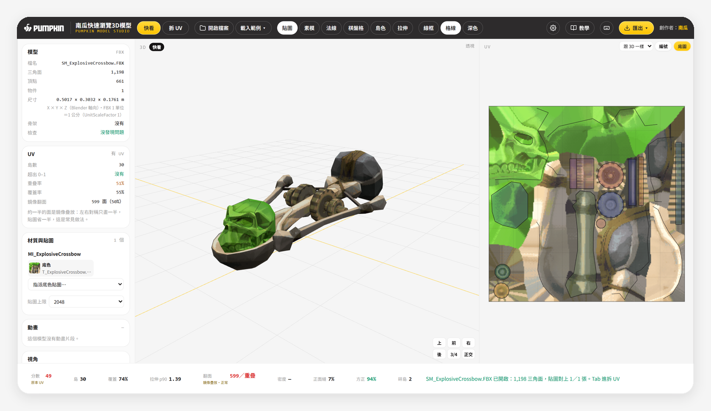
  <br><sub>▲ 快看模式：拖進 FBX＋貼圖，左邊資訊、中間 3D、右邊 UV 一次看完（範例：GG 爆裂弩）</sub>
</p>

## 📌 目錄

- [這是什麼](#-這是什麼)
- [三步開始](#-三步開始)
- [快看模式](#-快看模式)
- [拆 UV 模式](#-拆-uv-模式)
- [排版選項](#-排版選項)
- [分數怎麼看](#-分數怎麼看)
- [匯出](#-匯出)
- [快捷鍵](#-快捷鍵)
- [支援格式](#-支援格式)
- [GG 實測結果](#-gg-實測結果)
- [架構](#-架構)
- [常見問題](#-常見問題)
- [已知限制](#-已知限制)
- [給接手的 AI](#-給接手的-ai)
- [名詞對照表](#-名詞對照表)
- [更新紀錄](#-更新紀錄)

---

## 📖 這是什麼

南瓜快速瀏覽3D模型（Pumpkin Model Studio）把**看模型**和**拆 UV** 放在同一個網頁裡：FBX 連貼圖拖進來就能看，按 `Tab` 就進拆 UV。以 FBX 為主角（GLB、OBJ、STL、PLY 也吃），兩種模式一鍵切換，不用開 Blender。

| 模式 | 給誰 | 能做什麼 | 操作手感 |
|---|---|---|---|
| **快看**（預設） | PM、外包、不會 Blender 的人 | 面數、尺寸、貼圖、UV 體檢、動畫、存 PNG | 左鍵轉、滾輪縮、右鍵移 |
| **拆 UV**（按 `Tab`） | 3D 美術、畫貼圖的人 | 一鍵拆、修縫、島工具、排版、匯出 | 照 Blender 編輯模式：左鍵選、中鍵轉 |

拆 UV 的目標不是「數學上最省」，而是**畫貼圖的人好畫**：縫不在正面、島大又方正、左右對稱。拆法是拿 GG 專案的 15 個實際遊戲模型（武器、角色、建築）反覆校正出來的（見 [GG 實測結果](#-gg-實測結果)）。

> [!TIP]
> 只想看 glb／obj、不需要拆 UV？輕量版在 [南瓜 3D 模型快看器](https://github.com/terry12260201/pumpkin-model-viewer)。這個工具是它的進階版：快看器的功能全部包含在內，還多了 FBX、貼圖對應、UV 體檢與動畫。

---

## 🚀 三步開始

**1. 打開**：瀏覽器（Chrome／Edge）直接開 <https://terry12260201.github.io/pumpkin-model-studio/>；或下載 ZIP 後雙擊 `index.html`，離線也能用。不用安裝任何東西。

> 預期結果：第一次會跑 8 步導覽（快看 3 步＋拆 UV 5 步），可以按「略過」。網址後面加 `#notour` 可以直接跳過導覽。

**2. 放模型**：把 `.fbx` **連同貼圖**拖進畫面（整個資料夾的 PNG 一起拖也行）。手邊沒檔案就按頂欄「載入範例 ▾」：武器是 GG 的**爆裂弩**（前端有骷髏頭，正好看「縫避開臉」），角色是 Exorcist。

> 預期結果：模型自動置中對焦、貼圖自己對上，左邊出現檔名、面數、尺寸、UV 體檢。底欄狀態列寫「貼圖對上 N／N 張」。

**3. 拆 UV**：按 `Tab` → 左上「拆法」選「武器／角色／建築」→ 按 `U`。

> 預期結果：3D 模型變成彩色島、出現橘色自動縫，右邊 UV 排好版；底欄分數旁的小字從「原本 UV」變成「工坊拆」。75 分以上很好、60 分以上可用。

<p align="center">
  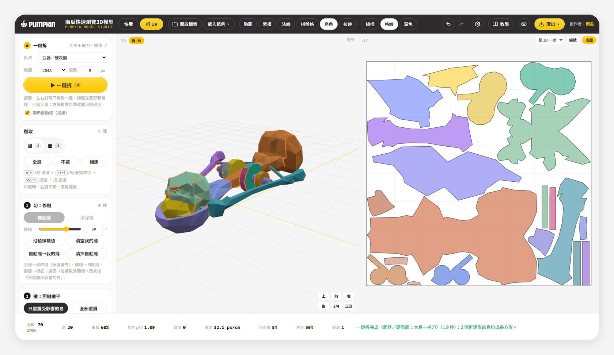
  <br><sub>▲ 按 U 之後：爆裂弩拆成 20 島、70 分（GG 原 UV 是 30 島）；骷髏臉沒有被中線劈開</sub>
</p>

---

## 👀 快看模式

快看模式是給「只想確認模型對不對」的人。拖進來就好，所有數字跟 Blender 看到的一樣（開發時用 Blender 5.2 背景模式讀同一批 FBX 逐項對照，±0）。

**左邊資訊欄有什麼**

| 區塊 | 內容 | 用途 |
|---|---|---|
| 模型 | 檔名、格式、三角面、頂點、物件數、尺寸（公尺，Blender 軸向 X×Y×Z）、骨架、單位註記 | 確認外包交的規格 |
| UV | 有沒有 UV、島數、超出 0–1、重疊率、覆蓋率、鏡像翻面 | 一眼看出 UV 有沒有問題 |
| 材質與貼圖 | 每個材質的貼圖縮圖；沒對上的列在「未指派」，拖縮圖或下拉就能指定 | 檢查貼圖有沒有漏 |
| 動畫 | 動畫片段清單、播放／暫停、拉時間軸（`Space` 播停） | 看骨架動畫 |
| 視角 | 前／右／上、正交、對焦、重置、**存 PNG** | 截圖丟給客戶或簡報 |

**頂欄顯示模式**：貼圖／素模／法線／棋盤格／島色／拉伸，另有線框、格線、深色三個開關。3D 右下角的視角方塊（上、前、右、後、3/4、正交）可以直接點。

<details>
<summary><b>🔍 貼圖怎麼自動對上材質</b></summary>

工具依檔名配對，優先順序如下：

1. FBX 裡記錄的貼圖檔名（最準）。
2. 前綴對應：`T_ExplosiveCrossbow.PNG` → 材質 `MI_ExplosiveCrossbow`、模型 `SM_ExplosiveCrossbow`（`T_`／`MI_`／`SM_` 前綴互換）。
3. 後綴判斷插槽：`_D`／`_BC` 是底色、`_N` 是法線、`_ORM` 自動拆成 AO／粗糙／金屬三個插槽。

超過「貼圖上限」（預設 2048，可選 1024／4096）的大圖會自動降採樣顯示，原檔不受影響；GG 建築的 8K 貼圖就是這樣開的。
</details>

---

## 🧩 拆 UV 模式

拆 UV 分三段：**切**（決定縫在哪）→ **攤**（照縫攤平）→ **排**（把島排進貼圖）。每段都能全自動，也能手動改；改完一條縫只重算碰到的島，其他不動。

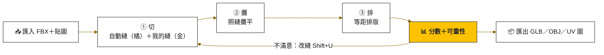

### 一鍵拆的五組預設

左上「拆法」選一組，按 `U`。每組＝切縫策略＋攤平參數＋排版方向，一次跑完三段，並且會同時試幾個方案、用分數挑最好的。

| 拆法 | 縫藏在哪 | 左右對稱 | 稜線角度 | 拉伸容忍 | 排版方向 | 適合 |
|---|---|:-:|---:|---:|---|---|
| **武器／硬表面** | 槍底、稜線；有起伏的正面中線（臉、徽章）切縫成本 ×6 | ✓ 只規劃一邊再鏡像 | 40° | 1.25 | 好畫（3D 上方朝上） | 槍、道具；方塊槍會同時試「沿銳邊切」 |
| **角色** | 背中線、身體兩側（腋下到腰）、手臂後側 | ✓ 左右成對規劃 | 60° | 1.30 | 省空間 | 人形角色，正面胸口整塊 |
| **建築** | 所有銳邊，每個大面一塊 | — | 30° | 1.15 | 好畫 | 牆、裝飾件、Trim Sheet |
| **布料** | 背面，縫越少越好 | ✓ | 75° | 1.30 | 省空間 | 衣服、披風 |
| **快速** | 不求完美 | — | 45° | 1.35 | 省空間 | 先看大概；10 萬面以上直接分島 |

<table>
  <tr>
    <td width="36%">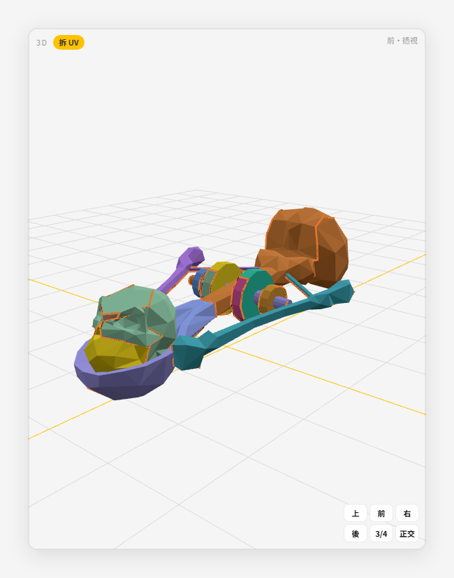</td>
    <td>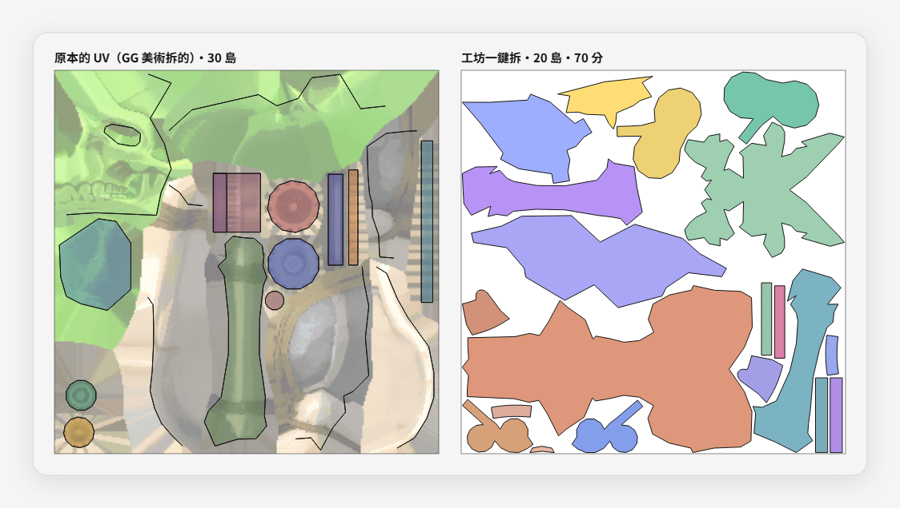<br><sub><b>武器</b>（爆裂弩）：縫走弩底與稜線，骷髏臉沒有中縫（頭骨和下顎在眼睛下方分兩塊），弓臂、圓彈各自整塊。左＝GG 原 UV，右＝一鍵拆。</sub></td>
  </tr>
  <tr>
    <td width="36%">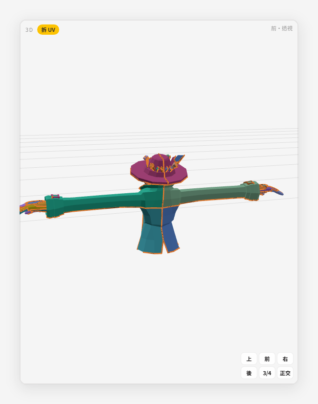</td>
    <td>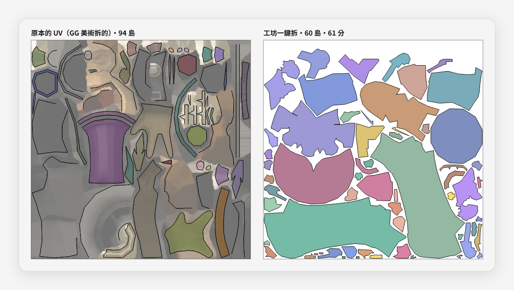<br><sub><b>角色</b>：正面胸口、外套連袖子一大塊，縫在背面；左右縫位置一樣，畫一邊對照另一邊。</sub></td>
  </tr>
  <tr>
    <td width="36%">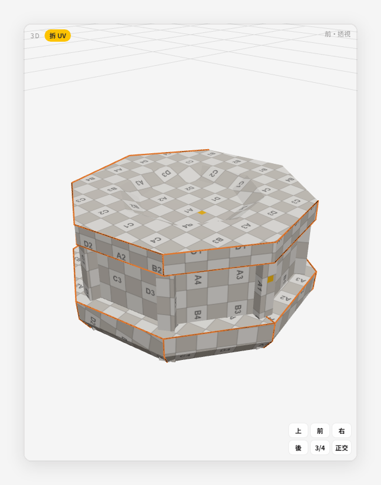</td>
    <td>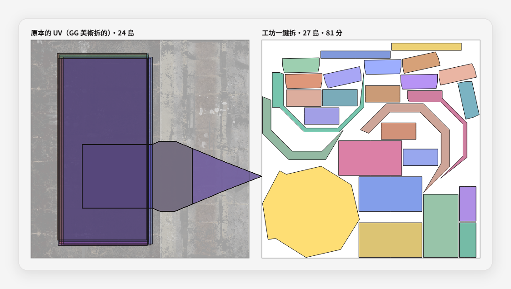<br><sub><b>建築</b>：沿銳邊切、每塊轉成「3D 的上＝UV 的上」，磚紋水平垂直好鋪。</sub></td>
  </tr>
</table>

### 修縫：想多切或少切一刀

1. 在 3D 上選邊：點一下選一條，`Alt`＋點選整圈（環選），`Ctrl`＋點選兩點間最短路徑，`Shift` 加選，拖曳塗選。
2. `Ctrl+E` 標成縫（金線＝你的縫，永遠優先），`Ctrl+Shift+E` 拿掉。
3. 按 `Shift+U`：**只重攤受影響的島**，其他島位置不動。

> 預期結果：底欄分數與島數立刻更新。「自動縫→我的縫」可以把橘色自動縫轉成可手改的金縫；「沿稜線標縫」依角度（預設 60°，可輸入）一次標完。

### 島工具

先在 UV 視窗或 3D 上選島，再按下面的工具：

| 工具 | 按鍵 | 做什麼 |
|---|---|---|
| 釘住／解釘 | `P`／`Alt+P` | 釘住的島重攤、重排都不動 |
| 鬆弛 | — | 讓島拉伸最小 |
| 拉直 | — | 最長的直邊轉成水平或垂直 |
| 矩形化 | — | 四邊形的島拉成長方形，畫直線就是直的 |
| 對齊軸 | — | 3D 的上方朝 UV 上方 |
| 翻 U／翻 V | — | 左右或上下翻（貼圖會鏡像） |
| 縫合 | `Alt+V` | 選到的縫邊兩側接起來 |
| 單島重拆 | — | 這一塊重新攤平 |
| 移／轉／縮 | `G`／`R`／`S` | 可直接打數字、`X`／`Y` 鎖軸、`Shift` 吸附；也能在面板輸入 U、V（px）、角度、倍率 |

---

## 📐 排版選項

排版的原則：一鍵、快、邊距精準等距、介面乾淨。排版在背景執行緒跑，畫面不卡，`Esc` 隨時取消。

<p align="center">
  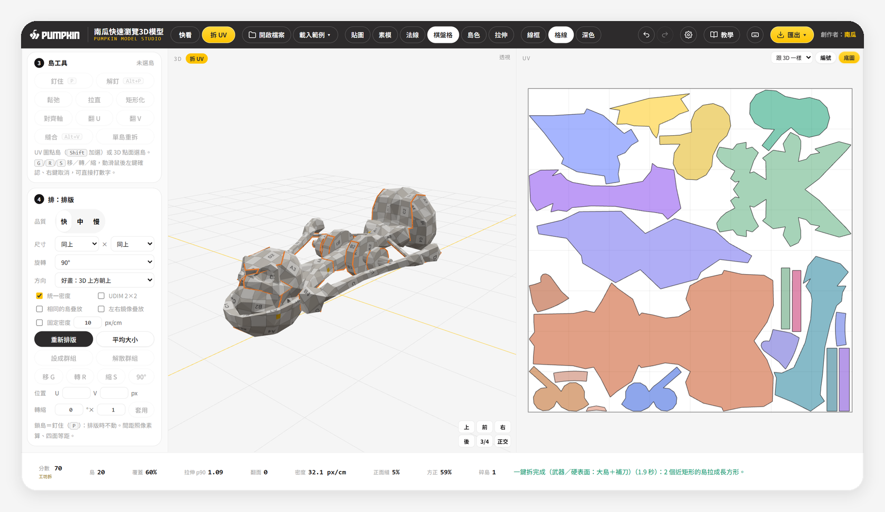
</p>

| 選項 | 可選值 | 預設 | 說明 |
|---|---|---|---|
| 品質 | 快／中／慢 | 快 | 快＝排一次（約 1 秒）；中＝多試 3 秒；慢＝多試 10 秒，越試越密 |
| 貼圖 | 1024／2048／4096 | 2048 | 換算像素間距與密度用 |
| 尺寸（寬×高） | 512–4096，可不一樣 | 同上 | 非正方形貼圖 |
| 間距 | 0–64 px | 8 px | 四面等距（實測 8px 最小島距 ≥ 7px） |
| 旋轉 | 不轉／90°／45°／15°／任意（10°） | 90° | 允許島轉幾度來塞得更密 |
| 方向 | 好畫：3D 上方朝上／省空間：最小外框／維持現在方向 | 依拆法 | 武器、建築預設「好畫」 |
| 統一密度 | 開／關 | 開 | 每塊島每公分分到的像素一樣 |
| 固定密度 | 數值 px/cm | 關（10） | 指定實際密度，多個模型對齊用 |
| 相同的島疊放 | 開／關 | 關 | 形狀一樣的島（螺絲、彈匣）共用一塊 |
| 左右鏡像疊放 | 開／關 | 關 | 左右對稱的島共用一塊，貼圖省一半（GG 原本就這樣做） |
| UDIM 2×2 | 開／關 | 關 | 島分到四格，不跨格 |
| 群組 | `Ctrl+G`／`Ctrl+Alt+G` | — | 選到的島排版時一起動 |
| 重新排版／平均大小 | `Ctrl+P`／`Ctrl+A` | — | 釘住的島不動，其他重排 |

> [!NOTE]
> **左右鏡像疊放預設關**，因為疊放的島會被品質檢查判成「翻面＋重疊」。勾了之後分數會把它當成刻意重疊、不扣分，但匯出時請確認引擎那邊的法線方向。

---

## 🎯 分數怎麼看

底欄一直顯示目前 UV 的品質。分數旁的小字寫「原本 UV」或「工坊拆」，告訴你這個分數是誰拆的。

| 指標 | 怎麼讀 | 好的範圍 |
|---|---|---|
| **分數 0–100** | 拉伸、角度、面積、密度一致、貼圖利用、縫長、碎島等綜合；滑鼠停在上面看組成 | 75↑ 很好、60↑ 可用、50↓ 要修 |
| 翻面／重疊 | 有任一項，分數直接封頂 49、底欄變紅；**原本 UV** 若是左右鏡像疊放，紅字下方會標「鏡像疊放・正常」 | 一鍵拆後 0 |
| 覆蓋 | 貼圖被島用到的比例 | GG 美術手排約 55–85% |
| 拉伸 p90 | 九成的面拉伸都在這個值以下 | 1.00 完美、1.3 以上看得出來 |
| 密度 | 每公分幾個像素（px/cm）；UV 視窗可切「密度熱圖」 | 越一致越好 |
| **正面縫** | 縫有多少比例落在看得到的正面 | 越低越好 |
| **方正** | 島面積 ÷ 外框面積 | 越高越好畫直線 |
| **碎島** | 極小碎片的數量 | 越少越好 |

最後三格叫「可畫性」，是第 2 輪照 QA 肉眼評分加上去的。頂欄切「拉伸」會出熱圖：紅色＝貼圖會被拉長的地方。

**剛開檔「翻面」就是紅字，是壞掉嗎？** 不是。很多遊戲模型（GG 的角色和大部分武器）原本的 UV 是**左右鏡像疊放**：美術只拆半邊，另一半翻過來疊在同一塊貼圖上，省一半貼圖。這種 UV 在品質檢查裡一定會算成「翻面＋重疊」，所以 v1.1 起，分數來源是「原本 UV」時，紅字下方會多一行「鏡像疊放・正常」，滑鼠停上去看完整說明；按 `U` 一鍵拆之後就恢復一般判定（翻面 0）。

<p align="center">
  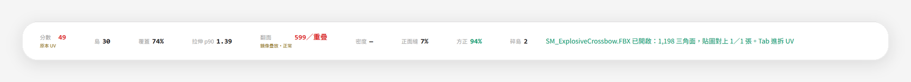
  <br><sub>▲ 爆裂弩剛開檔：翻面 599／重疊是原本 UV 的鏡像疊放，不是錯誤</sub>
</p>

<p align="center">
  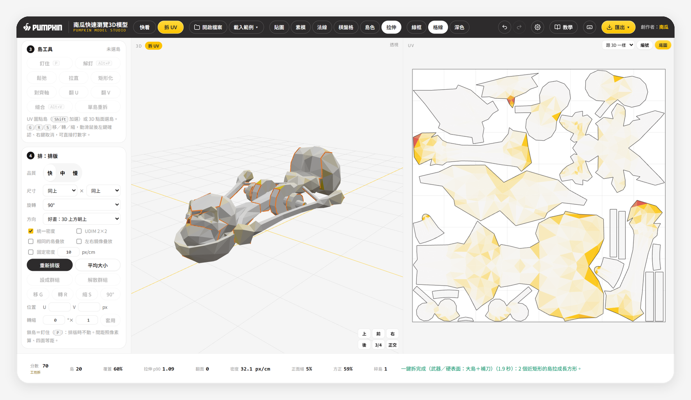
</p>

---

## 📦 匯出

一鍵拆完之後，頂欄「匯出 ▾」就會亮起來。

<p align="center">
  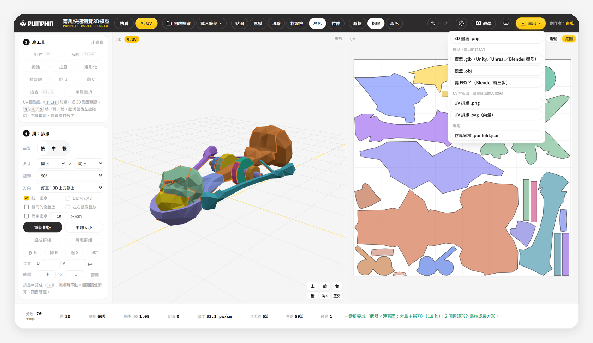
</p>

| 格式 | 內容 | 拿去哪 |
|---|---|---|
| `.glb` | 模型＋新 UV（v 已翻成 glTF 慣例） | Unity（裝 glTFast）、Unreal 5（直接拖）、Blender（匯入 glTF 2.0） |
| `.obj` | 模型＋新 UV | 老軟體、ZBrush |
| UV 排版 `.png` | 島外框圖 | Photoshop 最上層、混合模式「色彩增值」當參考 |
| UV 排版 `.svg` | 向量版，放大不糊 | Illustrator、Substance |
| 專案檔 `.punfold.json` | 縫、釘島、群組、排版設定（`Ctrl+S`） | 下次先開同一個模型，再把專案檔拖進來 |
| 3D 畫面 `.png` | 目前視角截圖 | 簡報、回覆客戶 |

**要 FBX 走三步**：① 這裡匯出 GLB ② Blender 匯入 glTF ③ 匯出 FBX（路徑模式選「複製」、勾「嵌入貼圖」；給 Unreal 用軸向選「前方 -Y、上方 Z」）。瀏覽器沒有可靠的 FBX 寫入器，GLB 是開放格式，UV 一模一樣。

---

## 🎹 快捷鍵

照 Blender。按 `?` 隨時叫出這張表。

<details>
<summary><b>🎹 完整快捷鍵表（25 組）</b></summary>

| 按鍵 | 功能 | 模式 |
|---|---|---|
| `Tab` | 快看 ↔ 拆 UV | 全部 |
| 數字鍵盤 `1`／`3`／`7` | 前／右／上視角（加 `Ctrl` 看反面） | 全部 |
| `5` | 透視／正交切換 | 全部 |
| `F`、數字鍵盤 `.` | 對焦（有選取就對焦選取） | 全部 |
| `Home` | 框住整個模型 | 全部 |
| `Space` | 動畫播放／暫停 | 快看 |
| `2`／`3` | 選邊／選面（上排數字） | 拆 UV |
| `Alt`＋點 | 環選（邊）／相連區（面） | 拆 UV |
| `Alt`＋左拖 | 筆電轉視角；`Alt+Shift`＋左拖平移 | 拆 UV |
| `Ctrl`＋點 | 最短路徑 | 拆 UV |
| `Shift`＋點、拖 | 加選、塗選（`Ctrl`＋拖塗掉） | 拆 UV |
| `A`／`Alt+A`／`L` | 全選／不選／相連 | 拆 UV |
| `Ctrl+E`／`Ctrl+Shift+E` | 標記縫／清除縫 | 拆 UV |
| `U` | 一鍵拆 | 拆 UV |
| `Shift+U` | 只重攤受影響的島 | 拆 UV |
| `P`／`Alt+P` | 釘住／解釘 | 拆 UV |
| `Alt+V` | 縫合 | 拆 UV |
| `Ctrl+P`／`Ctrl+A` | 重新排版／平均島大小 | 拆 UV |
| `B` | UV 框選 | 拆 UV |
| `G`／`R`／`S` | UV 島移／轉／縮（可打數字、`X`／`Y` 鎖軸） | 拆 UV |
| `Ctrl+G`／`Ctrl+Alt+G` | 設成群組／解散群組 | 拆 UV |
| `Esc` | 取消、清選取 | 全部 |
| `Ctrl+Z`／`Ctrl+Shift+Z` | 復原／重做（`Ctrl+Y` 也可） | 全部 |
| `Ctrl+S` | 存專案檔 | 全部 |
| `?` | 開關快捷鍵表 | 全部 |

</details>

<p align="center">
  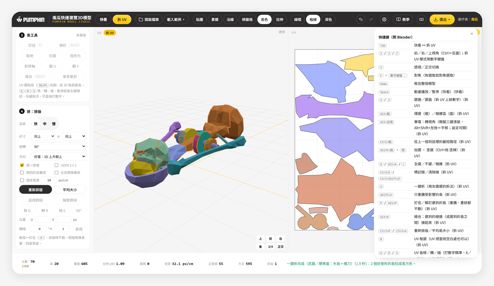
</p>

**筆電沒有中鍵、沒有數字鍵盤？** 頂欄「設定」有兩個開關：「模擬三鍵滑鼠」（預設開，`Alt`＋左拖轉視角）、「模擬數字鍵盤」（預設關；開了之後拆 UV 時上排 `1/3/7/5` 也是視角，選面改按 `4`）。

---

## 📂 支援格式

| 類型 | 支援 | 備註 |
|---|---|---|
| 模型 | `.fbx`、`.glb`、`.gltf`＋`.bin`、`.obj`＋`.mtl`、`.3ds`、`.stl`、`.ply` | FBX 是主角，讀 UnitScaleFactor 換算公尺；3DS 載入器在但沒實測 |
| 貼圖 | `.png`、`.jpg`、`.jpeg`、`.webp` | 跟模型一起拖；整個資料夾也行 |
| 專案檔 | `.punfold.json` | 先開模型再拖；形狀不同會拒絕 |
| 匯出 | `.glb`、`.obj`、`.png`、`.svg`、`.punfold.json` | FBX 走 Blender 轉 |

---

## 📊 GG 實測結果

驗收用南瓜虛擬科技 GG 專案的 15 個模型（武器 11、角色 3、建築 1）。自測腳本用 Playwright 真的開工具、拖 FBX＋整個資料夾貼圖、`Tab`、選預設、按 `U`，再跟 GG 美術原本的 UV 比。

**驗收門檻**：武器分數 ≥ 60 且島數 ≤ 原 ×1.5；角色分數 ≥ 50 且左右縫對稱 ≥ 95%；全部無翻面、無重疊。

| 模型 | 類 | 三角面 | 原島數 | 一鍵拆島數 | 分數 | 覆蓋 | 拉伸 p90 | 耗時 | 判定 |
|---|---|---:|---:|---:|---:|---:|---:|---:|:-:|
| SK_BaseGun_C | 武器 | 334 | 57 | 18 | 76 | 56.8% | 1.03 | 1.2s | PASS |
| SM_BambooCrossbow | 武器 | 2086 | 44 | 47 | 77 | 69.8% | 1.04 | 6.1s | PASS |
| SM_BaseGun_A | 武器 | 598 | 120 | 34 | 69 | 61.2% | 1.08 | 3.2s | PASS |
| SM_BaseGun_B | 武器 | 362 | 91 | 26 | 63 | 58.4% | 1.13 | 2.0s | PASS |
| SM_BaseGun_D | 武器 | 322 | 73 | 13 | 62 | 55.7% | 1.14 | 1.0s | PASS |
| SM_Crossbow | 武器 | 1530 | 26 | 20 | 64 | 57.2% | 1.13 | 1.5s | PASS |
| SM_ExplosiveCrossbow | 武器 | 1198 | 30 | 20 | 70 | 59.8% | 1.09 | 2.4s | PASS |
| SM_Flamethrower | 武器 | 1228 | 16 | 46 | 68 | 62.3% | 1.05 | 4.6s | 例外 |
| SM_HolyWater | 武器 | 1080 | 27 | 21 | 75 | 63.1% | 1.06 | 2.8s | PASS |
| SM_Rambo_BaseGun | 武器 | 1032 | 98 | 80 | 77 | 70.2% | 1.01 | 5.7s | PASS |
| SM_SMG | 武器 | 1212 | 163 | 52 | 69 | 62.3% | 1.10 | 4.5s | PASS |
| SM_Player_Exorcist | 角色 | 3130 | 94 | 60 | 61 | 65.8% | 1.08 | 4.1s | PASS |
| SM_Player_Knight | 角色 | 3520 | 80 | 58 | 61 | 61.0% | 1.08 | 8.9s | PASS |
| SM_Player_Rambo | 角色 | 2650 | 41 | 31 | 61 | 65.4% | 1.09 | 3.1s | PASS |
| SM_PR_ApeSkull02 | 建築 | 184 | 24 | 27 | 81 | 60.7% | 1.00 | 2.2s | PASS |

平均分數 68.9、覆蓋 62.0%、島數比 0.77。全部有效（無翻面、無重疊）。

- **可畫性肉眼評分（1–5）**：QA 第 1 輪 2.4 → 第 2 輪 2.9 → **第 3 輪結案 3.1**（v1.1 沒動切縫規則，數字不變）。三隻角色：Knight 3、Rambo 4、Exorcist 3。
- **角色對稱**：三隻對稱部位的縫左右 100% 對稱（QA 量法；Rambo 換半徑 2%／4%／8%、以零件算都在 98.8–100%）。
- **噴火器是裁定例外**：68 分、無翻面無重疊，但 46 島（原 16 島），超過島數門檻。GG 原 UV 靠左右折疊鏡像才做到那麼少。
- **大模型**：60 萬面用「快速」拆約 11 秒，`Esc` 0.49 秒回來；20 萬面排版不卡畫面、可取消。
- **最終驗收**：SPEC 22/22 過，14 個測試階段 Console 0 錯誤。

<details>
<summary><b>🧠 我們從 GG 原 UV 學到的四件事</b></summary>

- **左右鏡像疊放**：角色與大部分武器，原 UV 剛好一半的面是翻面的（Exorcist 3130 面裡 1565 面），代表美術只拆半邊、另一半鏡像疊上去。工具的「左右鏡像疊放」就是這招。
- **方塊槍＝沿稜線切**：BaseGun A／B／D、SMG、Rambo 槍，原 UV 幾乎全是長方形。「武器」預設會同時算「大島＋補刀」與「沿銳邊切」兩案，用分數挑。
- **曲面武器＝大島、容忍拉伸**：十字弓、噴火器、聖水，原 UV 島很少，每島拉伸 p90 約 1.3–1.7。
- **縫放哪**：原 UV 的縫大多在底部、背面、稜線上。工具的縫代價就照這個：被擋住、朝下、朝後、銳邊都便宜。
</details>

---

## 🧠 架構

所有重計算都在 Web Worker（背景執行緒），主畫面只負責畫圖。引擎檔不打包，`index.html` 直接用 `<script>` 載入，Worker 用它們的原始碼在 file:// 下重建。

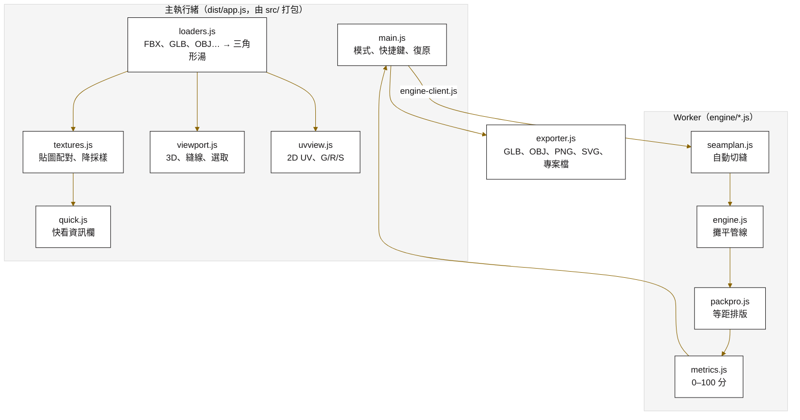

---

## ❓ 常見問題

<details>
<summary><b>拖進 FBX，模型是灰的？</b></summary>

材質沒對上貼圖。看左邊「材質與貼圖」的「未指派」，把縮圖拖到材質上，或用下拉選單指定。最穩的做法是把 FBX 和整個貼圖資料夾一起拖進來。
</details>

<details>
<summary><b>筆電沒有中鍵，拆 UV 模式轉不了視角？</b></summary>

按住 `Alt` 用左鍵拖就能轉（`Alt+Shift`＋左拖平移），或直接點 3D 右下角的視角方塊。這是頂欄「設定」裡的「模擬三鍵滑鼠」，預設已開。
</details>

<details>
<summary><b>一鍵拆的分數不到 60，怎麼辦？</b></summary>

先切「拉伸」熱圖找紅色的地方，在那附近 `Alt`＋點選一圈邊、`Ctrl+E` 加縫，再 `Shift+U`。也可以換一組拆法試試，例如方塊感強的道具改用「建築」。
</details>

<details>
<summary><b>專案檔拖進來被拒絕？</b></summary>

專案檔不含模型本體，只存縫和排版。要先開「同一個」模型再拖專案檔；模型形狀不同（面數、頂點不一樣）會拒絕載入，避免縫對錯位置。
</details>

<details>
<summary><b>匯出的 GLB 進 Unity 沒反應？</b></summary>

Unity 本身不吃 GLB，要先從 Window → Package Manager 裝 glTFast。或照「要 FBX 走三步」在 Blender 轉成 FBX。
</details>

---

## 🚧 已知限制

- **範例素材是南瓜自家 GG 專案的模型**（爆裂弩、Exorcist）：僅供本工具教學與測試，請勿另作他用。
- **噴火器、SMG 的島還是偏碎**：噴火器一鍵拆 46 島（GG 原本 16 島，可畫性 2）；SMG 52 島裡有不少十字形、拼圖形的島（可畫性 2）。想更像 GG：勾「左右鏡像疊放」；長期解是 OptCuts 引擎（另案）。
- **SK_BaseGun_C 上方約 13–18% 空白**：最長的槍身島（22 面、長寬比約 6.7）攤開就跟貼圖一樣寬，等密度排版被它卡住；要解得改武器切縫規則把它切短。
- **左右鏡像疊放預設關**：開了島數少一半（像 GG 原本那樣），但會被判成翻面＋重疊，所以預設關，要用請在排版區自己勾。原本 UV 本來就是鏡像疊放的模型，底欄會標「鏡像疊放・正常」。
- **角色背面會有幾道補刀小切口**（為了讓大島不拉伸）；不喜歡就 `Ctrl+Shift+E` 拿掉再 `Shift+U`。Knight、Exorcist 頭盔肩甲的碎島偏多；Rambo 身體是一大塊，拉伸比較大。
- **Rambo 的子彈帶本身斜掛、不對稱**，各自拆，不跟身體對稱。
- **爆裂弩的骷髏**：臉沒有中縫，但頭骨和下顎在眼睛下方有一條橫縫（封閉的頭一定要切開一刀）。
- **FBX 匯出**走 GLB＋Blender 轉；「送 Blender 橋接器」和「貼圖重烘（舊 UV → 新 UV）」還沒做。
- **UDIM** 時，最大的島放不進一格就不會變大。
- **3DS** 載入器在，但手邊沒有 3DS 檔，沒實測。
- **20 萬面以上**：排版在背景跑不卡，但一鍵拆（切縫規劃）會跑比較久，建議用「快速」。
- **頂欄**：視窗寬度 1600px 以下會縮成精簡版（藏署名與小標、「教學」只剩圖示）；拆 UV 模式在約 1400px 以下會折成兩行（功能正常）。

---

## 🤖 給接手的 AI

這段寫給接手維護的 AI 或工程師。讀完這段＋`SKILL.md`，就能安全地改它。

### 怎麼改

本 repo 含成品（`index.html`、`dist/`）與原始碼（`src/`、`engine/`）。改程式：`npm install` → 改 `src/` 或 `engine/` → `npm run build`（會先把 `src/ink-gold.css` 貼回 `index.html`，再打包 `dist/app.js`）。改完要連 `dist/app.js` 一起交。

### 檔案地圖

| 路徑 | 做什麼 |
|---|---|
| `index.html` | 版面（頂欄、左側面板 `view-only`／`edit-only` 兩套、3D、UV、底欄、教學、導覽、快捷鍵表）；墨金 CSS 由 build 貼進來 |
| `src/main.js` | 主流程：模式切換、載入、一鍵拆、修縫、島工具、排版、復原、匯出；`KEYMAP`（`?` 表）、`PRESET_INFO`、`QUALITY_MS` |
| `src/loaders.js` | 各格式 → three 場景＋三角形湯；`fbxVertexCount` 掃 FBX 節點樹拿 Blender 頂點數；UnitScaleFactor |
| `src/textures.js` | 貼圖解碼、降採樣、依檔名對材質、ORM 拆插槽 |
| `src/quick.js` | 快看面板：資訊、UV 體檢、材質縮圖拖指派、動畫 |
| `src/viewport.js` | 3D：貼圖／素模／法線／棋盤格／島色／拉伸、縫線、選取、視角 |
| `src/uvview.js` | 2D UV：多選、框選、G/R/S 模態、密度熱圖、編號、UDIM |
| `src/topo.js` | 主執行緒拓樸：環選、最短路徑、相連、島外框 |
| `src/exporter.js` | GLB／OBJ、UV PNG／SVG、專案檔 |
| `src/tutorial.js` | 8 步導覽（localStorage 記「不再顯示」、`#notour` 略過）＋教學 9 頁 |
| `src/ink-gold.css` | 墨金 1.2 樣式正本（改這裡，不要改 `index.html` 裡那段） |
| `engine/seamplan.js` | **自動切縫**（自寫）：對稱偵測、`PLAN_PRESETS` 五組預設、`presetCandidates` |
| `engine/packpro.js` | **排版**（自寫）：等距膨脹、縮放二分搜尋、鎖島、疊島、群組、UDIM、非正方形 |
| `engine/engine.js` | 管線：`autoUnwrap`、`unwrap`（incremental）、島操作、snapshot／restore |
| `engine/metrics.js` | 0–100 分與可畫性三項 |
| `engine/` 其他 | 沿用 M0 fork 的 MIT 程式（BFF／SLIM 攤平、舊排版、能見度、分島），授權見 `engine/LICENSE-engine.txt` |
| `dist/app.js` | `src/` 打包產物，**要一起交** |
| `dist/samples.js` | 內嵌範例（GG 爆裂弩 SM_ExplosiveCrossbow＋角色 Exorcist，base64），由 `tools/make-samples.cjs` 產生，勿手改 |
| `tools/inline-css.cjs` | build 第一步：把 `src/ink-gold.css` 貼回 `index.html` |
| `docs/教學.md`、`docs/img/` | 圖文教學（工具內「教學」是同一份） |
| `docs/readme/` | 本 README 的 Banner 與加框截圖 |

### SKILL.md 摘要

- **觸發詞**：開南瓜快速瀏覽3D模型、看模型、拆 UV、檢查 FBX 貼圖、修改／擴充這個工具、跑自測。
- **鐵則**：
  - 鎖版 `three 0.170.0`、`esbuild ~0.24.2`，不換版本、不換打包器。
  - `engine/*.js` 不打包，`index.html` 直接 `<script>` 載入；新增引擎檔要在 `index.html` 補一行。
  - 改快捷鍵要同步改 `KEYMAP`（`?` 表靠它）。
  - 自動切縫（`seamplan.js`）與排版（`packpro.js`）是自寫的，本工具維持 MIT；沿用的 M0 fork 程式授權見 `engine/LICENSE-engine.txt`。

### 怎麼驗證改對了

```powershell
npm install
npm run build
```

- Playwright 自測腳本（smoke／QA）與測試模型不隨本 repo 發佈。改完請用內建範例（爆裂弩、Exorcist）實際走一遍：快看資訊欄數字、`Tab` → `U` 一鍵拆的分數與島數、匯出 GLB，並確認 Console 0 錯誤。
- 改了切縫或排版，另外看「拉伸」熱圖與底欄「正面縫／方正／碎島」三格有沒有變差。

### 已知的坑

- **忘了 build**：改完 `src/` 沒跑 `npm run build`，雙擊開到的是舊的 `dist/app.js`。
- **`npm run test:engine`、`npm run smoke`** 指向不隨 repo 發佈的測試資料夾，指令會失敗；請照上面的方式手動驗證。
- **用 Playwright 自動化測它**：Chromium 要加 `--use-gl=swiftshader --enable-unsafe-swiftshader --allow-file-access-from-files`；網址不加 `#notour` 會被導覽擋住。
- **`src/main.js` 已過 900 行**，下次擴充建議拆 `ui-edit.js`／`ui-pack.js`。
- **改「角色」預設要小心**：第 3 輪修好的是「左右成對一起長」＋只鏡像互為鏡像的邊（`emir[emir[e]] === e`）；改了要重跑三隻角色的左右縫對稱量測。

---

## 📚 名詞對照表

| 名詞 | 白話 | 在工具裡 |
|---|---|---|
| UV | 3D 模型攤平到貼圖上的座標，U 橫、V 直 | 右邊 UV 視窗 |
| 縫（Seam） | 剪開的邊，攤平時從這裡分開 | 金線＝你的縫、橘線＝自動縫 |
| 島（Island） | 攤平後連在一起的一塊 | 島色模式每塊一個顏色 |
| 拉伸 | 貼圖被拉長或擠扁的程度 | 拉伸熱圖、拉伸 p90 |
| p90 | 九成的面都比這個數字好，避免一兩個怪面把數字拉爆 | 底欄拉伸 |
| 覆蓋率 | 貼圖被島用到的比例 | 底欄覆蓋 |
| 間距（Padding） | 島與島之間留的像素，避免縮圖時顏色互相滲 | 排版「間距」 |
| Texel 密度 | 每公分分到幾個像素，越一致越好畫 | 統一密度、固定密度 |
| 釘住（Pin） | 這塊島重攤、重排都不動 | `P`／`Alt+P` |
| 疊放（Stack） | 形狀一樣的島共用同一塊貼圖 | 相同的島疊放、左右鏡像疊放 |
| 稜線／銳邊 | 兩個面折角很大的邊（像桌角），縫切在這裡最不明顯 | 沿稜線標縫 |
| 環選 | 按住 Alt 點一條邊，一整圈都選起來 | `Alt`＋點 |
| 正交 | 沒有近大遠小的視角，像工程圖 | `5` |
| Trim Sheet | 一張貼圖裡排好可重複的條紋，很多面共用 | 建築預設 |
| UDIM | 貼圖分多格（1001、1002…），高解析用 | UDIM 2×2 |
| 可畫性 | 畫貼圖的人好不好畫：縫不在正面、島方正、沒碎片 | 底欄最後三格 |

---

## 📝 更新紀錄

| 日期 | 內容 |
|---|---|
| 2026-09-30 | 拆 UV 引擎：M0 技術驗證（選定 MIT fork 當攤平核心）、三欄版面、照 Blender 手感調整 |
| 2026-10-07 | 看模型＋拆 UV 合體：M1 快看＋拆 UV、M2 拆法預設、M3 排版、M4 教學、M5 匯出 |
| 2026-10-07 | 第 2 輪可畫性修正（正面縫、方正、碎島三項入分數）；第 3 輪角色修正（胸口無中縫、左右縫 100% 對稱），QA 結案 22/22 |
| 2026-10-07 | 拆成獨立 repo，README 重寫 |
| 2026-10-07 | **v1.1**：定名「南瓜快速瀏覽3D模型」（頂欄、標題、導覽、教學、README）；範例武器換成 GG 爆裂弩（有骷髏臉，示範縫避開臉），教學「怎麼拆武器」與截圖跟著換；原本 UV 的翻面紅字旁加「鏡像疊放・正常」白話標註，一鍵拆後恢復一般判定；README 截圖重拍（1.5 倍） |
| 2026-10-08 | **v1.2**：頂欄尺寸、間距、Logo 對齊南瓜拓印工具（56px 高、26px Logo、34px 膠囊鈕，功能不變）；README 頂部加線上入口，`.github/workflows/pages.yml` 自動部署 GitHub Pages；文件移除內部路徑與參考來源；截圖重拍 |

---

<sub>🎃 屬於 [pumpkin-skills 南瓜自建 AI 技能庫](https://github.com/terry12260201/pumpkin-skills) · 由 南瓜虛擬科技 製作 · 最後更新 2026-10-08（v1.2）</sub>
