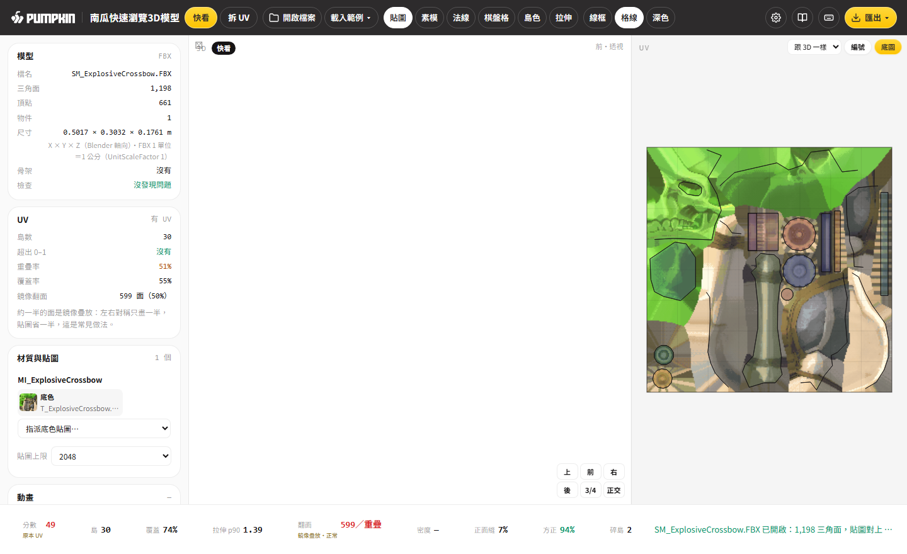
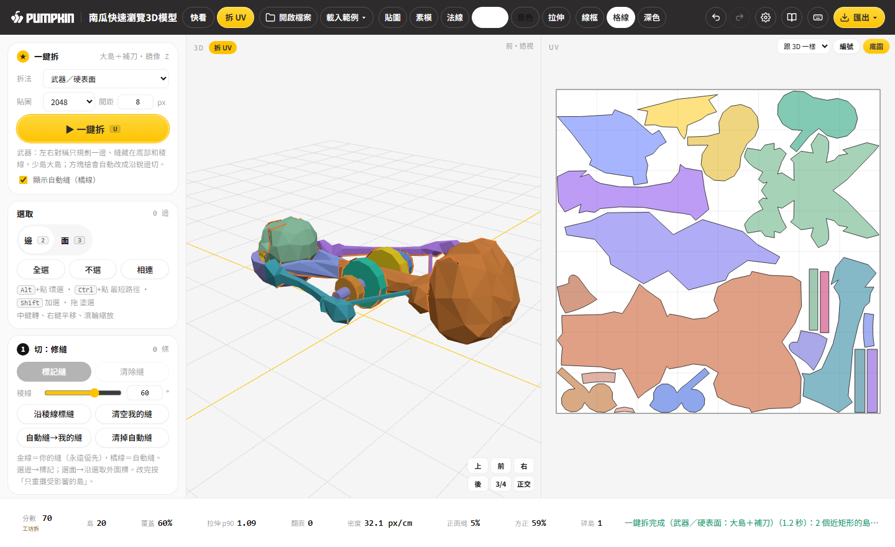
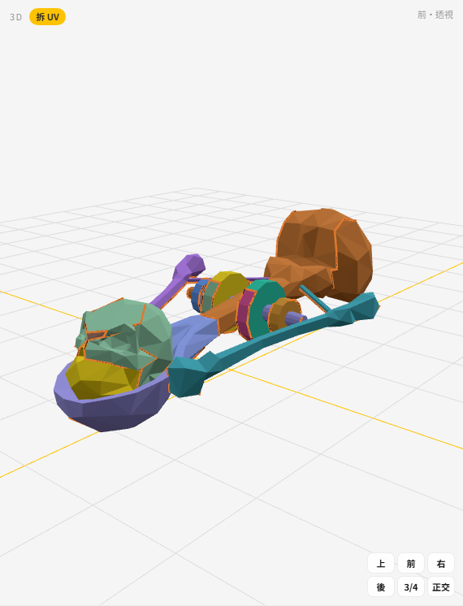
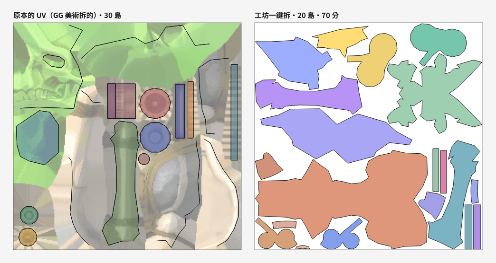
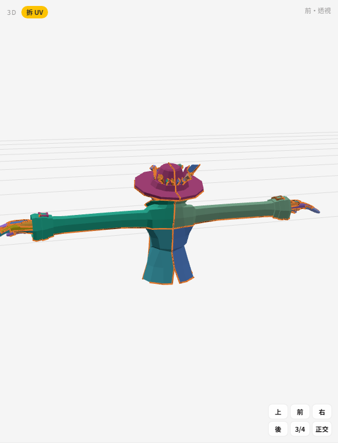
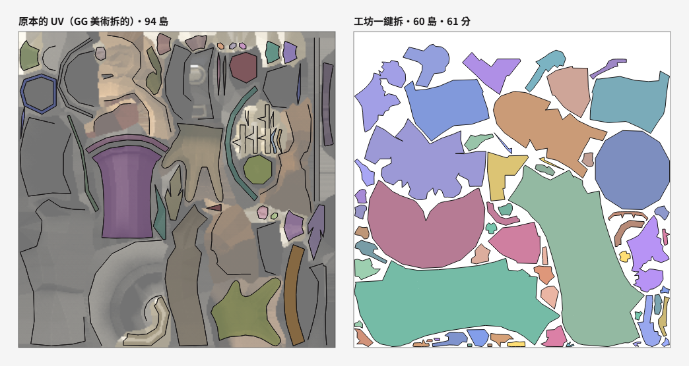
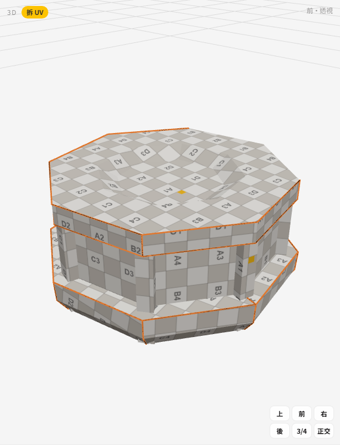
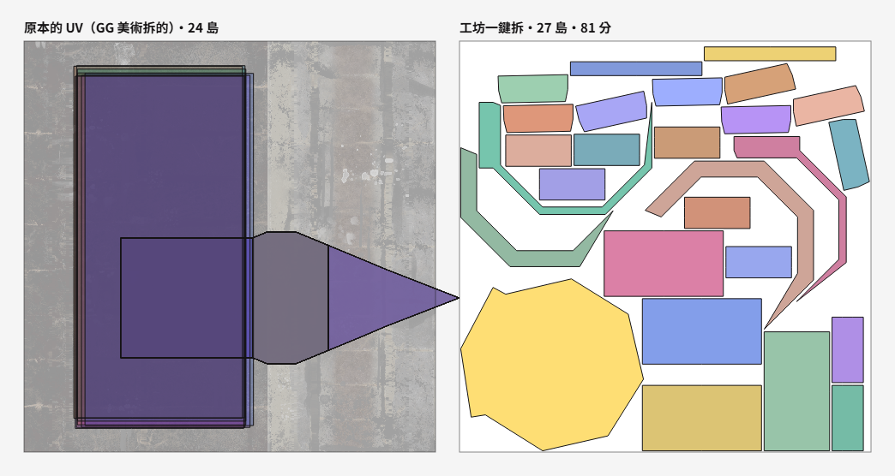

# 南瓜快速瀏覽3D模型 · 教學

> 給「完全不會拆 UV」的人。每一節 10 行以內，圖全部用 GG 自家模型截的（`docs/img/`）。
> 工具裡頂欄「教學」是同一份內容；第一次打開會自動跑 8 步導覽，頂欄「教學 → 重看導覽」可以再看。

---

## 1. 30 秒看模型（快看模式）

1. 雙擊 `index.html` 打開（Chrome／Edge，不用網路）。
2. 把 FBX **連同貼圖**一起拖進來——整個資料夾的 PNG 一起拖也行，工具會照檔名自己對（`T_ExplosiveCrossbow.PNG` → 材質 `MI_ExplosiveCrossbow`）。
3. 左鍵轉、滾輪縮、右鍵移；`1`／`3`／`7` 前／右／上視角，`5` 正交，`F` 對焦，`Home` 重置。
4. 左邊看面數、頂點、尺寸（公尺、跟 Blender 一模一樣）、UV 有沒有超出 0–1、重疊多少、貼圖對上沒。
5. 頂欄切 貼圖／素模／法線／棋盤格；轉到好角度按「存 PNG」。

## 2. 30 秒拆 UV

1. 按 `Tab` 進「拆 UV」（Blender 手感：左鍵選、中鍵轉、右鍵移；筆電沒有中鍵：`Alt`＋左拖轉、或點 3D 右下角視角方塊）。
2. 左上「拆法」選 武器／角色／建築／布料／快速，按 `U`。
3. 看底欄分數（75↑很好、60↑可用；小字寫「原本 UV」或「工坊拆」）＋「正面縫／方正／碎島」三格可畫性；頂欄切「拉伸」看熱圖（紅＝會被拉長）。
4. 不滿意：選邊（`Alt`+點 環選）→ `Ctrl+E` 加縫，`Ctrl+Shift+E` 拿掉 → `Shift+U` 只重攤改到的島。
5. 滿意的島按 `P` 釘住，`Ctrl+P` 重排其他的；「匯出 ▾」出 GLB＋UV 排版圖。

## 3. 怎麼拆武器（以 SM_ExplosiveCrossbow 爆裂弩為例）

爆裂弩前端有一顆骷髏頭，正好示範「縫避開臉」。按「載入範例 ▾ → 武器：SM_ExplosiveCrossbow」就能跟著做。

- **縫放哪**：走**弩底**和**稜線**（兩個面折角很大的邊）；弩身側面、刻花、骷髏的臉**盡量不切**。實測：骷髏臉**沒有中縫**（不會被左右劈開）；上半顆頭骨和下顎分成兩塊，交界是眼睛下方一條橫縫，鼻孔凹槽周圍也有一圈縫（頭是封閉的，總要切開）；後面那顆圓彈、弓臂各自整塊。其他武器還有的小毛病：少數握把側面會有一條斜縫（BaseGun_B），聖水瓶口圓盤仍被中線切開。
- **為什麼**：拿武器的人從側面、上面看，底下和折角看不到；折角本來就換顏色，接縫看不出來。臉、徽章正中間一切就毀了，所以工具會把「有起伏的正面中線」切縫成本調高六倍。
- **畫的人怎麼受益**：側面大多是整片大島，木紋、刮痕、骨頭紋路一筆畫過去不斷；島會自動擺正（長邊水平、上面朝上）——但只有跟外框差 25° 以內的才轉正，少數島還是斜放，需要時選島按 R 輸入角度自己轉；近長方形的島會被拉成長方形；太小的碎片自動併回旁邊的大島。
- **原本 UV 的翻面／重疊是正常的**：爆裂弩剛開時底欄「翻面」會是紅字 599／重疊，旁邊標「鏡像疊放・正常」——GG 美術把左右兩半疊在同一塊貼圖上省空間，不是檔案壞掉。按 U 一鍵拆後就是 0。
- **方塊槍**（SK_BaseGun_C、Rambo 槍那種）工具會同時算「沿銳邊切」：每個平面一塊長方形——GG 原本就是這樣拆的，分數高就自動採用。

## 4. 怎麼拆角色（以 SM_Player_Exorcist 為例）

- **縫放哪**：縫走**背後中線**、身體**兩側（腋下到腰）**、手臂後側或下面；臉、胸口、外套正面都不切（第 3 輪實測：Knight 胸甲正面一整塊、Rambo 正面軀幹連手臂一整塊、Exorcist 背心正面一整塊）。背心、帽子、手套本來就是分開的零件，各自一塊；Rambo 斜掛的子彈帶不對稱，各自拆。
- **為什麼**：玩家看到的是正面跟臉，正面不能有縫；背面、內側本來就暗、被擋住。
- **畫的人怎麼受益**：外套正面連著袖子是一大塊，扣子、花紋一筆畫過去；左右兩邊的縫位置一樣（工具左右成對規劃：一邊切一刀、另一邊鏡像同一刀，三隻角色對稱部位 100% 對稱），畫一邊對照另一邊；極小碎片自動併回大島（Exorcist 碎島 20→6）。
- **想省貼圖**：勾「左右鏡像疊放」，左右共用同一塊——GG 原 UV 剛好一半的面是鏡像，就是這招（會被分數當成「刻意重疊」，預設關）。

## 5. 怎麼拆建築（以 SM_PR_ApeSkull02 城堡裝飾為例）

- **縫放哪**：沿所有**銳邊**切，每個大面一塊。
- **大面朝軸對齊**：每塊都轉成「3D 的上＝UV 的上」，牆面就是正的長方形。
- **畫的人怎麼受益**：磚紋、石縫是水平垂直的，島正的就能直接鋪重複貼圖或 Trim Sheet，不用一塊一塊轉。
- **大貼圖**：建築常用 8K（這個模型的 BC／N／ORM 都是 8192），工具自動降到 2048 顯示，不會當；ORM 自動拆成 AO／粗糙／金屬三個插槽。
- 歪掉的島：選起來按「對齊軸」或「矩形化」。

## 6. 分數怎麼看

- **0–100 分**：75↑很好、60↑可用、50↓要修。滑鼠停在分數上看組成：拉伸、角度、面積、密度一致、貼圖利用、縫長、碎島。
- **翻面或重疊**直接封頂 49（底欄翻面變紅）；勾了「疊放」的島是刻意重疊，不扣分。
- **覆蓋**：貼圖被用到的比例，GG 美術手排約 55–85%，工坊一鍵拆平均約 62%。
- **拉伸 p90**：九成的面拉伸都在這個值以下，1.00 完美，1.3 以上看得出來。
- **密度 px/cm**：每公分幾個像素；UV 視窗切「密度熱圖」，藍＝太稀、紅＝太密。

## 7. Blender 快捷鍵對照

| 按鍵 | 功能（跟 Blender 一樣） |
|---|---|
| `Tab` | 快看 ↔ 拆 UV（Blender：物件 ↔ 編輯模式） |
| 數字鍵盤 `1`／`3`／`7`（`Ctrl`＝反面）、`5` | 前／右／上視角、正交 |
| `F`／數字鍵盤 `.`、`Home` | 對焦選取、框全部 |
| `2`／`3` | 選邊／選面 |
| `Alt`+點、`Ctrl`+點、`Shift`+點 | 環選、最短路徑、加選 |
| `A`／`Alt+A`／`L` | 全選／不選／相連 |
| `Ctrl+E`／`Ctrl+Shift+E` | 標記縫／清除縫 |
| `U`／`Shift+U` | 一鍵拆／只重攤受影響的島 |
| `P`／`Alt+P` | 釘住／解釘 |
| `Alt+V` | 縫合 |
| `Ctrl+P`／`Ctrl+A` | 排版／平均大小 |
| `B`、`G`／`R`／`S`（可打數字、`X`／`Y` 鎖軸） | 框選、移／轉／縮 |
| `Ctrl+G`／`Ctrl+Alt+G` | 群組／解散 |
| `Ctrl+Z`／`Ctrl+Shift+Z`、`Ctrl+S`、`?` | 復原／重做、存專案、快捷鍵表 |

## 8. 匯出到 Unity／Unreal／Blender

- **Unity**：匯出 GLB → Package Manager 裝 glTFast → 拖進 Assets；或轉 FBX（見下）。
- **Unreal 5**：直接匯入 GLB（Interchange）；要 FBX 就轉，前方 -Y、上方 Z。
- **Blender**：檔案 → 匯入 → glTF 2.0。
- **要 FBX（三步）**：① 這裡匯出 GLB ② Blender 匯入 glTF ③ 匯出 FBX（路徑模式「複製」＋「嵌入貼圖」）。瀏覽器沒有可靠的 FBX 寫入器，所以走 GLB，UV 一模一樣。
- **UV 排版圖**：PNG 放 Photoshop 最上層設「色彩增值」當參考；SVG 是向量，放大不糊。
- **專案檔** `.punfold.json`：縫、釘島、排版設定都在裡面；下次先開同一個模型，再把專案檔拖進來。

## 9. 名詞表

| 名詞 | 白話 |
|---|---|
| UV | 3D 模型攤平到貼圖上的座標，U 橫、V 直 |
| 縫（Seam） | 剪開的邊，攤平時從這裡分開 |
| 島（Island） | 攤平後連在一起的一塊 |
| 拉伸 | 貼圖被拉長或擠扁的程度 |
| 覆蓋率 | 貼圖被島用到的比例 |
| 間距（Padding） | 島與島之間留的像素，避免縮圖時顏色互相滲 |
| Texel 密度 | 每公分分到幾個像素，越一致越好畫 |
| 釘住（Pin） | 這塊島重攤、重排都不動 |
| 疊放（Stack） | 形狀一樣的島共用同一塊貼圖 |
| 鏡像 | 左右對稱的一半翻過去共用 |
| 稜線／銳邊 | 兩個面折角很大的那條邊（像桌角），縫切在這裡最不明顯 |
| 環選 | 按住 Alt 點一條邊，沿著它一整圈的邊都選起來 |
| 重攤 | 重新攤平；Shift+U 只重攤改到的島 |
| 熱圖 | 用顏色表示數值的圖：紅＝數值高（拉伸大、太密） |
| p90 | 九成的面都比這個數字好，避免一兩個怪面把數字拉爆 |
| 正交 | 沒有近大遠小的視角（像工程圖） |
| Trim Sheet | 一張貼圖裡排好可重複的條紋（磚、木條），很多面共用 |
| 可畫性 | 畫貼圖的人好不好畫：縫不在正面、島方正、沒有碎片（底欄「正面縫／方正／碎島」三格） |
| UDIM | 貼圖分多格（1001、1002…），高解析用 |
